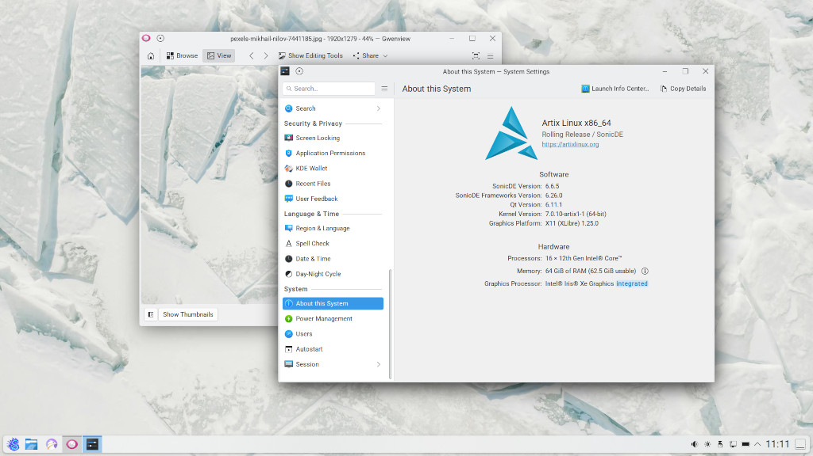

# SonicDE Packages for Artix Linux Systems

This third-party repository provides [SonicDE](https://sonicde.org) x86_64 binary  packages for [Artix Linux](https://artixlinux.org). SonicDE, or the Sonic Desktop Environment, aims to preserve and improve the X11-specific aspects of KDE. You can learn more about SonicDE at [sonicde.org](https://sonicde.org/).

## Switching to SonicDE Automatically

You can download and run the [`sonic-switch.sh`](sonic-switch.sh) script to automatically switch to SonicDE on your Artix Linux system:

```
curl -O https://sonicde-artix.github.io/sonic-switch.sh
sh sonic-switch.sh
````

You'll be asked to compare the fingerprint of the OpenPGP key used to sign the packages with this one:
```text
D166 B8DB 57D1 55D5 7B4C  469F 72AA A517 26BC 3C29
```

The script may restart your graphical session so please save all your work beforehand. It will also silently replace the conflicting KDE components with the SonicDE ones. At the end, you have the option to switch to the [Sonic Login Manager](https://github.com/Sonic-DE/sonic-login-manager) from your current one. In case you don't get logged out automatically, please do so manually and log in again to start using SonicDE.

## Installing SonicDE Manually

### Adding the Public Package Signing Key to pacman

First, please download the public OpenPGP signing key [`sonicde-artixlinux.asc`](https://sonicde-artix.github.io/sonicde-artixlinux.asc) used to sign the packages and add it to the pacman keyring:

```shell
curl -O https://sonicde-artix.github.io/sonicde-artixlinux.asc
sudo pacman-key --add sonicde-artixlinux.asc
sudo pacman-key --finger 72AAA51726BC3C29
sudo pacman-key --lsign-key 72AAA51726BC3C29
```

You can read more about package signing on the [pacman/Package signing - ArchWiki](https://wiki.archlinux.org/title/Pacman/Package_signing#Adding_unofficial_keys) page.

### Adding the Repository to Pacman

Once you added the public key, also add an entry for the SonicDE repository to the end of the file [`/etc/pacman.conf`](https://man.archlinux.org/man/pacman.conf.5) using [`sudo`](https://wiki.archlinux.org/title/Sudo) and your favorite editor:

```ini
[sonicde]
Server = https://sonicde-arch.github.io/$arch
```

Run `pacman` to update all package indexes and installed packages:

```shell
sudo pacman -Syyu
```

### Installing SonicDE

Installing SonicDE is as easy as installing the `sonicde-meta` package:

```shell
sudo pacman -S sonicde-meta
```

The included packages will replace any of their installed KDE counterparts. When asked, just answer with `y `. To make use of SonicDE, log out of your desktop session and log in again.

In case you get kicked out of a running KDE session while you're installing SonicDE, just re-run `pacman` after you logged in again and let it install the missing packages:

```shell
sudo pacman -S sonicde-meta
```

When done, start the program `System Settings` and verify that you're running SonicDE on the "About this System" page. You do? Congratulations!

## Migrating From Older Repositories

There are, or rather were, two older repositories containing SonicDE third-party packages for Artix Linux. These could be found at the following addresses:

```conf
Server = https://artixlinux.duckdns.org/repos/sonicde
Server = https://x11libre.net/repo/arch_based/x86_64/sonicde
```

Please note that these repositories are no longer being updated. You can migrate to our repository by importing our OpenPGP key [`sonicde-artixlinux.asc`](https://sonicde-artix.github.io/sonicde-artixlinux.asc) as described above in "Adding the Public Package Signing Key to pacman". Then replace the old `Server` URLs with the following one in your `/etc/pacman.conf`:

```conf
Server = https://sonicde-artix.github.io/$arch
```
Finally run `pacman -Syu` to update the installed SonicDE packages and the rest of your system.

## Getting in Contact

Please report any enhancement requests or issues with this repository at [Issues · sonicde-artix/sonicde-artix](https://github.com/sonicde-artix/sonicde-artix/issues). If you have a specific issue, please see the [list of package repositories](https://github.com/orgs/sonicde-artix/repositories?q=topic%3Apackage) and report it there. In case you need help, want to report success, or talk about other aspects, please also check the official SonicDE channels.

&nbsp;[Bluesky](https://bsky.app/profile/sonicdesktop.bsky.social)&nbsp; &nbsp;[Discord](https://discord.gg/cNZMQ62u5S) &nbsp; &nbsp;[Mastodon](https://mastodon.social/@sonicdesktop) &nbsp; &nbsp;[Matrix](https://matrix.to/#/#sonicdesktop:matrix.org) &nbsp; &nbsp;[OFTC IRC](https://webchat.oftc.net/?channels=sonicde%2Csonicde-devel%2Csonicde-dist&uio=MT11bmRlZmluZWQb1) &nbsp; &nbsp;[Telegram](https://t.me/sonic_de) &nbsp; &nbsp;[X (Twitter)](https://x.com/SonicDesktop)


